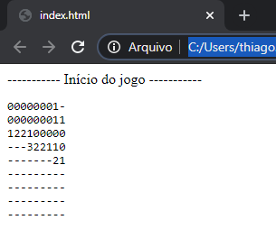

# Campo Minado
O jogo foi bastante difundido pelo sistema operacional Windows nos anos 90.
Robert Donner e Curt Johnson foram contratados pela Microsoft em 1989. Curt tinha escrito um programa para o sistema operacional da IBM(OS/2), cujo objetivo era você conseguir atravessar um campo minado de um canto da tela para outro ileso. Robert queria escrever um jogo para Windows para aprimorar sua programação no sistema operacional, e Curt deixou que ele utilizasse o seu código fonte como ponto de partida. Mais tarde a Microsoft decidiu lançar uma coleção de jogos para sua nova plataforma e os funcionários foram convidados a enviar jogos. O campo minado foi enviado e um dos escolhidos a pertencer ao sistema operacional.

## Objetivo do jogo
O jogo consiste em uma matriz quadrada, que ao primeiro clique revela algumas posições. A partir das posições reveladas o jogador devera descobrir todos as posições que não contêm minas terrestres sem ser "explodido". A localização das minas terrestres é descoberta através de um processo lógico, onde o número de uma determinada posição representa a quantidade de minas terrestres em volta dele.

### **Exemplo**

Aqui temos o início de um jogo, repare que a posição marcada de amarelo possui o número 1, portanto em volta deste número possui uma mina terrestre. Como possuímos apenas uma posição não aberta destacada em vermelho, indica que ela possui uma mina terrestre e que não devemos abrir está posição.


Agora podemos analisar uma próxima posição (destacada de amarelo). Repare que em volta do número existem duas posições que não abrimos, mas uma possui uma bomba (descoberta na etapa anterior), portanto ficou liberado a casa destacada em verde, pois a posição atual indica que em volta existe apenas uma mina terrestre. Assim ela está livre para abrir.


Outro exemplo é a casa destaca em amarelo, nesta situação onde todas as posições não abertas são iguais ao número da posição destacada, indica que todas as posições possuem uma mina terrestre.


Se no passo anterior descobrimos três minas terrestres, o item destacado em amarelo possui duas minas terrestres em volta. Portanto a posição destaca em verde está livre para abrirmos.


Antes de enfrentar o desafio, que tal jogar algumas partidas para você entender a dinâmica: https://minesweeper.online/

# Desafio
Neste repositório existe uma página web (index.html) que importa o script campo-minado.js que realiza instância a classe CampoMinado.


Está classe é responsável por iniciar um novo jogo do campo minado. Nela temos disponíveis os seguintes métodos:

 - `campoMinado.Tabuleiro()`: Retorna o tabuleiro atual no formato de `string`. Veja o que acontece quando imprimimos seu valor na página (Linha 15 da imagem anterior):
 
 
    

    - `Valores númericos`: Números de minas terrestres que a posição possui em volta;
    - `Traço (-)`: Posições que ainda não foram abertas, a qual o seu algoritmo deve analisar a string retornada pelo método Tabuleiro() e tomar a decisão de abrir ou não.
- `campoMinado.JogoStatus()`: Método que retorna (inteiro) o status do jogo atual. A cada tentativa de abertura de uma posição o seu retorno é diferente.
    - `0`: Jogo em aberto, continue procurando as posições que não possuem minas terrestres;
    - `1`: Vitoria, você encontrou todas as posições que não possuem minas terrestres;
    - `2`: Game Over, você encontrou uma mina terrestre.
- `campoMinado.Abrir(int linha, int coluna)`: Método responsável por abrir uma posição. Como o tabuleiro é uma matriz 9x9 , você deve informar linha e coluna entre 1 e 9 para abrir. Sempre que você pedir para abrir uma posição o retorno do método Tabuleiro() é atualizado com a posição aberta e o método JogoStatus() ao executar irá retornar o novo status (0, 1 ou 2). 

Como todos sabem, uma string é um vetor de caracteres, portanto o objetivo do algoritmo é realizar a leitura da string retornada pelo método Tabuleiro() utilizando a lógica de identificação das minas terrestres conforme a sessão objetivo do jogo. Após analisar e identificar que é seguro abrir uma posição, seu algoritmo deve chamar o método Abrir(linha, coluna) da classe CampoMinado. Ao abrir todas as posições que não possuem minas terrestres o método JogoStatus() irá passar retornar o valor 1 de vitória.

## Roteiro
1. Ter uma conta no GitHub;
2. Criar um novo projeto no GitHub e realizar o clone do mesmo em sua máquina;
3. Baixar o código fonte inicial [neste link](https://github.com/ivory-it/ivoryit-testeestagio-campo-minado-js/archive/master.zip);
4. Colocar o projeto no diretório do projeto clonado da sua conta do GitHub;
5. Altere a página index.html com seu script de solução com sua IDE de preferência;
6. Após finalizar e ter o algoritimo completo, basta subir as alterações (commit/push) para sua conta e responder o e-mail do teste com o link da sua conta no GitHub, para que possamos analisar sua codificação.

## Dicas / Regras
1. Ao codificar matenha seu código limpo e coerente. Manter padronização ajuda a equipe entender o que foi codificado, além de ajudar nas manutenções futuras;
2. O arquivo `campo-minado.js` não pode ser modificado;
3. O algoritimo deve analisar a string que representa o tabuleiro, não é valido fixar a abertura das posições que não possuem minas terrestres pela analise do algoritmo `campo-minado.js`;
4. Não é para criar uma aplicação onde o usuário escolha qual posição abrir, é para ser um algoritimo autonomo que realize as jogadas;
5. Exemplo de um algotimo realizando as jogadas até encontrar todas as posições sem minas terrestres:
```
----------- Início do jogo -----------
00000001-
000000011
122100000
---322110
-------21
---------
---------
---------
---------
----------- Status: Jogo em aberto -----------
00000001-
000000011
122100000
---322110
-------21
---------
---------
---------
---------
Bomba encontrada: linha(1) / coluna(9)
Bomba encontrada: linha(4) / coluna(3)
Bomba encontrada: linha(4) / coluna(2)
Bomba encontrada: linha(5) / coluna(7)
----------- Status: Jogo em aberto -----------
00000001-
000000011
122100000
---322110
-------21
---------
---------
---------
---------
Abrindo casa: linha(4) / coluna(1)
----------- Status: Jogo em aberto -----------
00000001-
000000011
122100000
1--322110
-------21
---------
---------
---------
---------
Abrindo casa: linha(5) / coluna(2)
Abrindo casa: linha(5) / coluna(1)
----------- Status: Jogo em aberto -----------
00000001-
000000011
122100000
1--322110
12-----21
---------
---------
---------
---------
Abrindo casa: linha(5) / coluna(6)
----------- Status: Jogo em aberto -----------
00000001-
000000011
122100000
1--322110
12---4-21
---------
---------
---------
---------
Bomba encontrada: linha(5) / coluna(5)
Bomba encontrada: linha(5) / coluna(4)
Abrindo casa: linha(6) / coluna(2)
Abrindo casa: linha(6) / coluna(1)
----------- Status: Jogo em aberto -----------
00000001-
000000011
122100000
1--322110
123--4-21
0013-----
00012222-
000000011
000000000
Bomba encontrada: linha(6) / coluna(5)
Bomba encontrada: linha(6) / coluna(6)
Abrindo casa: linha(6) / coluna(7)
----------- Status: Jogo em aberto -----------
00000001-
000000011
122100000
1--322110
123--4-21
0013--3--
00012222-
000000011
000000000
Bomba encontrada: linha(6) / coluna(8)
Bomba encontrada: linha(7) / coluna(9)
----------- Status: Jogo em aberto -----------
00000001-
000000011
122100000
1--322110
123--4-21
0013--3--
00012222-
000000011
000000000
Abrindo casa: linha(6) / coluna(9)
----------- Status: Vitoria -----------
00000001-
000000011
122100000
1--322110
123--4-21
0013--3-2
00012222-
000000011
000000000
```

## Resultado - Instruções do Código
1. Cria um Array (vazio) de bombas;
2. Condição de executar o código enquanto o jogo estiver aberto (campoMinado.JogoStatus() === 0);
3. Começa a percorrer todas as linhas e colunas da matriz (for dentro do for);

## Etapa 01
1. Cria a variável matriz e transforma a string em um array de strings (método .split), criando uma matriz;
2. Cria uma série de instruções para que a gente possa conferir as posições;
 2.1. Todo casa percorrida que for diferente de 0 e "-" é um número inteiro, dito isso, a gente transforma o valor (string) em um número inteiro;
 2.2. Seta flags para as posições que não possuem Acima, Abaixo, Esquerda e/ou Direita;
 2.3. Seta flags para posições abertas/fechadas ao redor do item analisado;
 2.4. Cria um contador de blocos com possibilidade de serem abertos ao redor do item avaliado;
 2.5. Cria um contador de bombas encontradas ao redor do item avaliado;
3. Começa a conferir cada posição ao redor, sempre com as respectivas exceções.
4. Se a condição for satisfatória, add ao contador "open";
5. Se a condição for satisfatória, marca a flag como true;
6. Confere dentro do array de bombas se a posição não esta contida. Caso verdadeiro, add ao contador "bombasEntorno";

## Etapa 02
1. Se o valor analisado for igual o número de casas possíveis de abrir, então significa que a(s) casa(s) contem bomba.
2. Verifica as flags e posições e caso não estejam no array de bombas, add e exibe a mensagem.
 2.1. Para evitar repetição de informações no array de bombas e exibição da mensagem, for add a condição de já não conter a informação dentro do array. 

## Etapa 03
1. Se o valor analisado for igual ao número de bombas no entorno (bombasEntorno), então significa que a(s) casa(s) são números. 
2. Verifica as flags e posição. Caso não estejam no array de bombas, pode executar a função para abrir (campoMinado.Abrir(l, c)) e exibem mensagem;